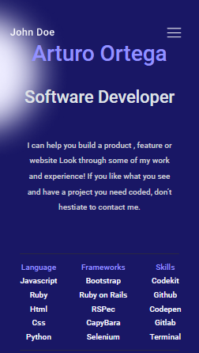

# Portafolio Project

> A webpage to show others projects on a elegant way

## Live Demo

[Live Demo](https:eroiyo.github.io/My-Portafolio/)

## Getting Started

To get a local copy up and running follow these simple example steps.

Download it from this repository, and double click into index.html

## Authors

👤 **Author1**

- GitHub: [@eroiyo](https://github.com/eroiyo)
- LinkedIn: [LinkedIn](https://www.linkedin.com/in/carlos-arturo-ortega-guanipa-39a1a5204/)

## 🤝 Contributing

Contributions, issues, and feature requests are welcome!

Feel free to check the [issues page](../../issues/).

## Acknowledgments

Microverse

## Show your support

Give a ⭐️ if you like this project!

## 📝 License

This project is [MIT](./MIT.md) licensed.
